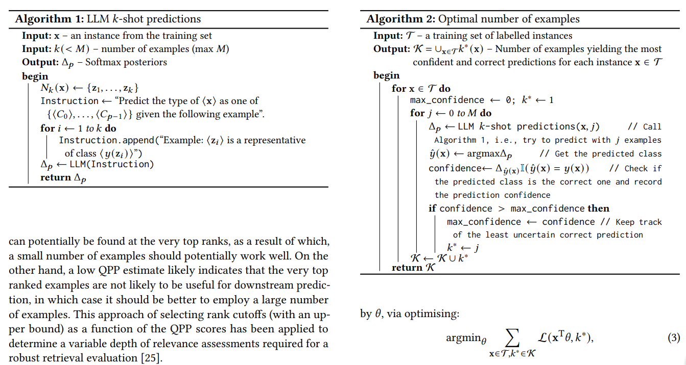
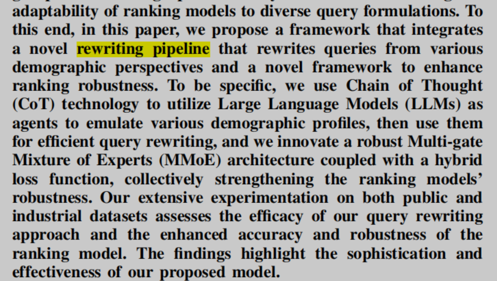
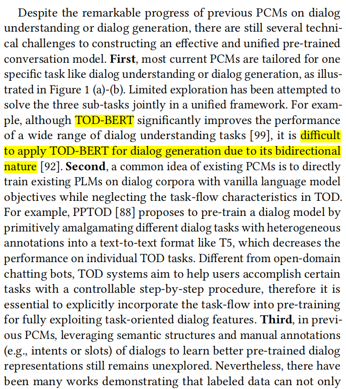
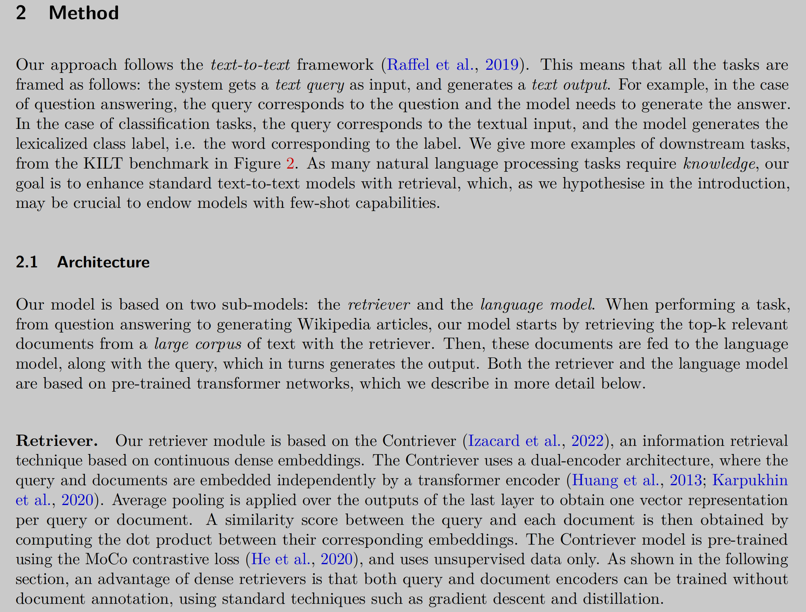
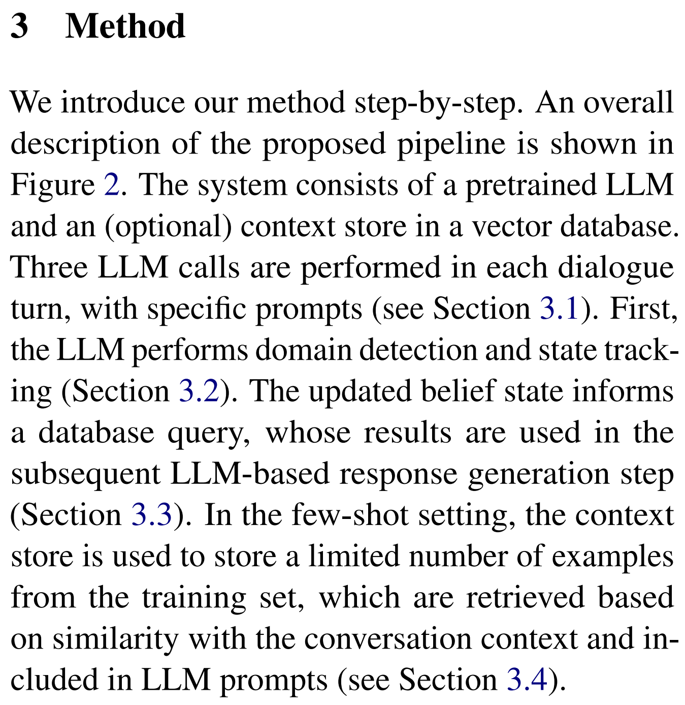
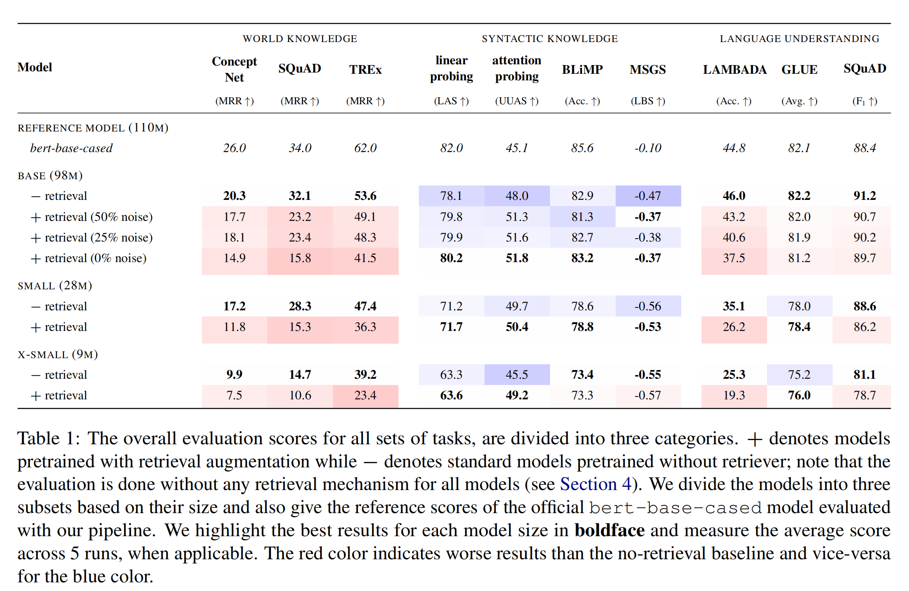

# general writing skills

## when idea is simply and straightforward

- 想法简单，但是可能具体实现有很多困难。

  - In this way, it is able to better learn the similarity relations among query, positive passages and negative passages. Although the idea is appealing, it is not easy to implement due to three major issues. First, it is unclear how to formalize and learn both query-centric and passage-centric similarity relations. Second, it requires arge-scale and highquality training data to incorporate passage-centric similarity relation. However, it is expensive to manually label data. Additionally, there might be a large number of unlabeled positives even in the existing manually labeled datasets (Qu et al., 2020), and it is likely to bring false negatives when sampling hard negatives. Finally, learning passagecentric similarity relation (an auxiliary task) is not directly related to the query-centric similarity relation (a target task). In terms of multi-task viewpoint, multi-task models often perform worse than their single-task counterparts (Alonso and Plank, 2017; McCann et al., 2018; Clark et al., 2019). Hence, it needs a more elaborate design for the training procedure.
  - To this end, in this paper, we propose a novel approach that leverages both query-centric and PAssage-centric sImilarity Relations (called PAIR) for dense passage retrieval. In order to address the aforementioned issues, we have made three important technical contributions. First,
  - 这个范例很好的展示这种情况怎么写。重点说明为什么不好实现或中间具体的困难在哪里，不然的话如果真的那么容易文章就没那么大价值了，谁都可以做吗。避免审稿时，审稿人可能一看可能觉得这个好像也大的创新。

- 方法简单，但是效果好
  - danqi chen: SimCSE
  - This paper presents SimCSE, a simple contrastive learning framework that greatly advances the state-of-the-art sentence embeddings. We first describe an unsupervised approach, which takes an input sentence and predicts itself in a contrastive objective, with only standard dropout used as noise. **_This simple method works surprisingly well, performing on par with previous supervised counterparts._** We hypothesize that dropout acts as minimal data augmentation and removing it leads to a representation collapse. Then, we draw inspiration from the recent success of learning sentence embeddings from natural language inference (NLI) datasets and incorporate annotated pairs from NLI datasets into contrastive learning by using “entailment” pairs as positives and “contradiction” pairs as hard negatives.
  - 这篇文章想法和实现都简单得不像话，如果功底一般哪怕发现了 SimCSE 中的 tricks 可以提高也发不了顶会，甚至自己都觉得想法太简单，就一个 trick 而已就不些论文了。但是大神就是大神，分析的神出鬼没，感叹一个牛字。做研究基本功很重要。

## 虽然前人有进展，但是还是值得研究

- Despite the progress made so far, there is still a need for developing a more precise method for peptide–MHC binding prediction to reduce the large number of false positives and thus improve the confidence of the predicted peptide–MHC interactions. In addition, improving the correlations between predicted and measured binding affinities may help quantify the binding advantage of neoantigens compared to the wild-type version, which can further facilitate vaccine development. Moreover, the prediction results from most of the previous methods

## 方法有明显不足不能实现，但也有好的方面

- In this paper, DSI is applied to moderate-sized corpora (from 10k to 320k documents), all of which
  are derived from one challenging retrieval task, and we leave the important question of the scaling
  DSI to larger corpora to future work.
-

## conclusion is in contrast to prior work.

- However, we observe that BM25 could show a competitive ranking quality compared to TILDE and TILDEv2 which is in contrast to the findings about the relative performance of these three models on retrieval for short queries reported in prior work. This result raises the question about the use of contextualized term-based ranking models being beneficial in QBE setting. We follow-up on our findings by studying the score interpolation between the relevance score from TILDE (TILDEv2) and BM25.

## 不同 components 或方法性能可以累加

We see an accuracy increase of over 6 p.p. when fine-tuning the model and this is cumulative with RAG, which increases accuracy by 5 p.p. further. In one particular experiment, we also demonstrate that the fine-tuned model leverages information from across geographies to answer specific questions, increasing answer similarity from 47% to 72%.

## 跟前人不同

- StyleTTS 2 differs from its predecessor by modeling styles as a latent random variable through diffusion models to generate the most suitable style for the text without requiring reference speech, achieving efficient latent diffusion while benefiting from the diverse speech synthesis offered
  by diffusion models.

-

## 没有指出具体前人的不足

- However, the quest for robust and accessible human-level TTS synthesis remains an ongoing challenge because there is still room for improvement in terms of diverse and expressive speech [5, 6], robustness for out-of-distribution (OOD) texts [7], and the requirements of massive datasets for high-performing zero-shot TTS systems [8].

- However, our focus is more on how to better process and present data based on human preference, rather than merely retrieving it from databases. Additionally, while SQL is convenient, it can not directly satisfy common data analysis needs such as prediction and visualization.

## absent of something 没人做过

- Absent of a clear benchmark for evaluating the performance of LLM routers, progress in this area has been hampered. To bridge this gap, we present RouterBench, a novel evaluation framework designed to systematically assess the efficacy of LLM routing systems, along with a comprehensive dataset comprising over 405k inference outcomes from representative LLMs to support the development of routing strategies. We further propose a theoretical framework for LLM routing, which provides a principled explanation for the observed performance differences between routing systems.

- Yet, the absence of a standardized benchmark for evaluating the performance of LLM routers hinders progress in this area. To bridge this gap, we present RouterBench, a novel evaluation framework designed to systematically assess the efficacy of LLM routing systems, along with a comprehensive dataset comprising over 405k inference outcomes from representative LLMs to support the development of routing strategies. We further propose a theoretical framework for LLM routing,

## 提出要探讨的问题

- We raise the question to what extent LLMs are capable of handling these applications off-the-shelf, i.e. without finetuning.

## present 结论

- While there may be room for improvement through prompt engineering, our results aim to show the out-of-the-box LLM capabilities.

## present algorithm

- 

## 小的优化，集成创新

- Retrieve Anything To Augment Large Language Models
  - Training such a unified model is non-trivial, as various retrieval tasks aim to capture distinct semantic relationships, often subject to mutual interference. To address this challenge, we systematically optimize our training methodology. This includes reward formulation based on LLMs’ feedback, the stabilization of knowledge distillation, multi-task fine-tuning with explicit instructions, and homogeneous in-batch negative sampling.

## others

- The challenges faced by RAG systems, such as ensuring contextually appropriate and up-to-date data, are addressed by the dynamic nature of knowledge graphs.
-

# Paper Structure

## Abstract

- 1. 研究的问题是什么，及重要性。
- 2. 当前主流的方法（特别是你要比较的方法）是什么，存在那些问题。
- 3. 你是如何创造性的解决了这些问题的，具体怎么做的。
  - 
- 4. 实验结果是什么？结论是什么？有什么重要/有趣的发现。
  - 例如在 xx 最有代表性的数据集上，比 SOTA 在那些点上还好。
  - 个人偏向：结果呈现时直接给出具体数据。例如：We use a test set annotated by academic researchers in the fields of quantum physics and computer vision to evaluate our system’s performance. The results show that DocReLM achieves a Top 10 accuracy of 44.12% in computer vision, compared to Google Scholar’s 15.69%, and an increase to 36.21% in quantum physics, while that of Google Scholar is 12.96%.
  -

### 引出你做的事

- However, despite
the success of foundation models in modalities
such as natural language processing and computer
vision, the development of foundation models for
time series forecasting has lagged behind. We
present Lag-Llama, a general-purpose foundation model for univariate probabilistic time series forecasting based on a decoder-only transformer architecture that uses lags as covariates.

## Introduction

- 研究的问题是什么，为什么重要。
- 回顾最主要的对论文研究问题的主要研究工作、进展，
- 前任研究工作的主要不足在哪里，为什么到现在还没人解决难点在哪里？（如果没有难点，那你的研究工作也没意义？）|或者你发现了什么研究空白，确立研究机会。
  - 从普遍的 problem 到具体的 question
- 针对以上问题，你的研究思路是什么？你是如何创造性的解决这个问题的？
- 你的方法效果怎么样？实验结果是什么？
- 总结该文的主要贡献

### 如何说现有工作的缺点

- SPACE-3
- 

### samples

- Top-Down Partitioning for Efficient List-Wise Ranking [Abstract]. Argument 清晰具体
  - Large Language Models (LLMs) have significantly impacted many facets of natural language processing
    and information retrieval. Unlike previous encoder-based approaches, the enlarged context window
    of these generative models allows for ranking multiple documents at once, commonly called list-wise
    ranking. However, there are still limits to the number of documents that can be ranked in a single
    inference of the model, leading to the broad adoption of a sliding window approach to identify the 𝑘
    most relevant items in a ranked list. We argue that the sliding window approach is not well-suited
    for list-wise re-ranking because it (1) cannot be parallelized in its current form, (2) leads to redundant
    computational steps repeatedly re-scoring the best set of documents as it works its way up the initial
    ranking, and (3) prioritizes the lowest-ranked documents for scoring rather than the highest-ranked
    documents by taking a bottom-up approach. Motivated by these shortcomings and an initial study that
    shows list-wise rankers are biased towards relevant documents at the start of their context window,
    we propose a novel algorithm that partitions a ranking to depth 𝑘 and processes documents top-down.
    Unlike sliding window approaches, our algorithm is inherently parallelizable due to the use of a pivot
    element, which can be compared to documents down to an arbitrary depth concurrently. In doing so, we
    reduce the number of expected inference calls by around 33% when ranking at depth 100 while matching
    the performance of prior approaches across multiple strong re-rankers.

## Related Work

- 1. 深入地分类介绍了相关的工作：
  - 2. 介绍时，要说清楚跟当前论文的关系。
  - 3.

## Method

- 引出部分（最好有个整体架构/流程图）： Figure 2 presents an overview of our approach for open-domain retrieval，

### 好的参考

- StyleTTS：
  - 先写一个 A. Proposed Framework 把问题和符号定义清楚。
- 

- are llms all you need for TOD
  

- itransformer

## Experiments

### Compared Methods

- We evaluate Mimir against the following methods:
- 

## Discussion

- 1. 描述实验结果
  - 提供必要的数据和数量，确保准确性；
  - 使用图标、表格或图像可视化工具来呈现
- 2. 解释结果
  - 说明你观察到的现象或趋势，并**解释**
  - 结果与最初假设是否有差异
  - 进行统计分析

## Conclusion

- 一总结、一结果、一展望
- 总结做了什么工作（1-2 句）
- 主要结果是什么
- 展望工作的重要性，升华研究意义

# paper style examples

## good in general

- [Query in Your Tongue: Reinforce Large Language Models with
](https://dl.acm.org/doi/pdf/10.1145/3589334.3645701)
  - good in general
- [Optimizing Error-Bounded Lossy Compression for Scientific Data on GPUs](https://openreview.net/pdf?id=4SXEZSNxTe)

## comparable studies

## survey

- Dense Text Retrieval based on Pretrained Language Models: A Survey

## evaluation only

- More Room for Language: Investigating the Effect of Retrieval on Language Models
  - examine how retrieval augmentation affects the behavior of the underlying language model.

## no innovation but vertical application

- BMRETRIEVER: Tuning Large Language Models as Better Biomedical Text Retrievers

# Tables

## color and title

- 
- from: More Room for Language: Investigating the Effect of Retrieval on Language Models

# tools

## polish

* <https://www.citexs.com/Editing>